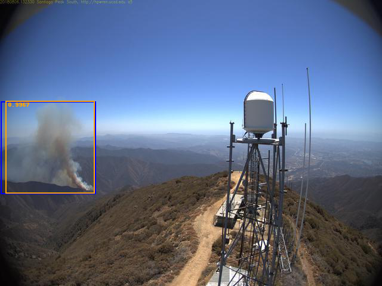

# Wildfire_detection

Detection of wildfire using information from unmanned drones.


*[more examples](images/)*

## Requirements:
- [Pillow](https://github.com/python-pillow/Pillow/)
- [cython](https://github.com/cython/cython)
- [pytorch](https://github.com/pytorch/pytorch)
- [torchvision](https://github.com/pytorch/vision)

## Install all requireents in conda enviroment
```
conda env create -n <env-name> -f ./Detector/environment.yml
```

## Dataset

[Wildfire Smoke Dataset](https://public.roboflow.com/object-detection/wildfire-smoke/1) - contains 737 images presplited on train, test and validation samples + bounding boxes (RetinaNet Keras format is used). My version of dataset could be found on my [drive](https://drive.google.com/drive/folders/12NAUwoHxRGPJNlh-X-KwkpMZR-6XvnHc?usp=sharing).

Expanding dataset is planned in the future.

## Installing pycocotools
not necessary (already stored in in ./lib/)
```
git clone https://github.com/cocodataset/cocoapi.git
cd cocoapi/PythonAPI
make
cp -r pycocotools/ ~/wildfire_detection/Detector/lib
```
## Pretrained model

You can download serialised pretrainde model from my [drive](https://drive.google.com/drive/folders/1IrzhmyoD90DNltTF0g3Jr6fyeLT1Ox5Q?usp=sharing) because it is too large for git.
